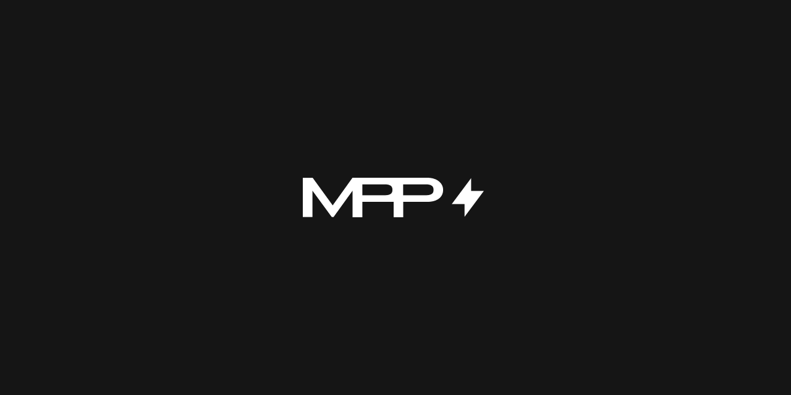

<p align="center">
  
</p>

# solana-mppx

Solana payment method for the [MPP protocol](https://mpp.dev). 

[MPP](https://mpp.dev) (Machine Payments Protocol) is [an open protocol proposal](https://paymentauth.org) that lets any HTTP API accept payments using the `402 Payment Required` flow.

## Architecture

```
solana-mpp-sdk/
├── src/
│   ├── Methods.ts          # Shared charge schema (Method.from)
│   ├── constants.ts        # Token programs, USDC mints, RPC URLs
│   ├── server/
│   │   └── Charge.ts       # Server: generate challenge, verify on-chain
│   └── client/
│       └── Charge.ts       # Client: build tx, sign, send, confirm
└── examples/
    ├── server.ts           # USDC-gated API (devnet)
    └── client.ts           # Headless client with keypair
```

**Exports:**
- `solana-mpp-sdk` — shared method schema + constants
- `solana-mpp-sdk/server` — server-side charge + `Mppx`, `Store` from mppx
- `solana-mpp-sdk/client` — client-side charge + `Mppx` from mppx

## Development

```bash
npm install
npx tsc --noEmit          # typecheck
npm run example:server    # run example server (devnet)
npm run example:client    # run example client (devnet)
```

## Roadmap

- [ ] Session method (metered billing for streaming)
- [ ] Tests against localnet
- [ ] Dynamic priority fees
- [ ] Multi-token acceptance per endpoint

## License

MIT
